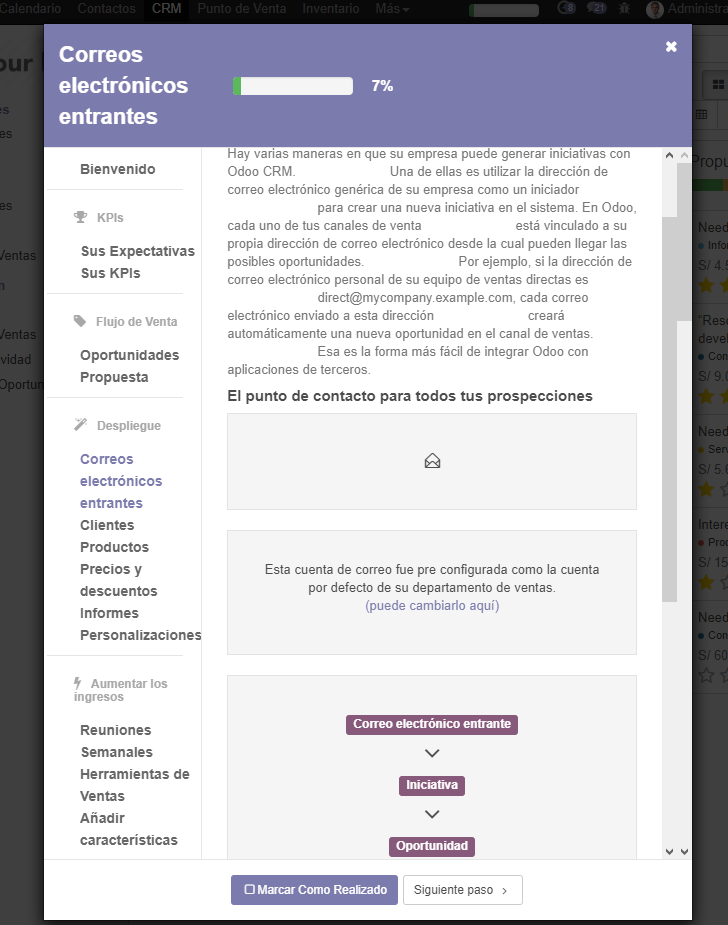
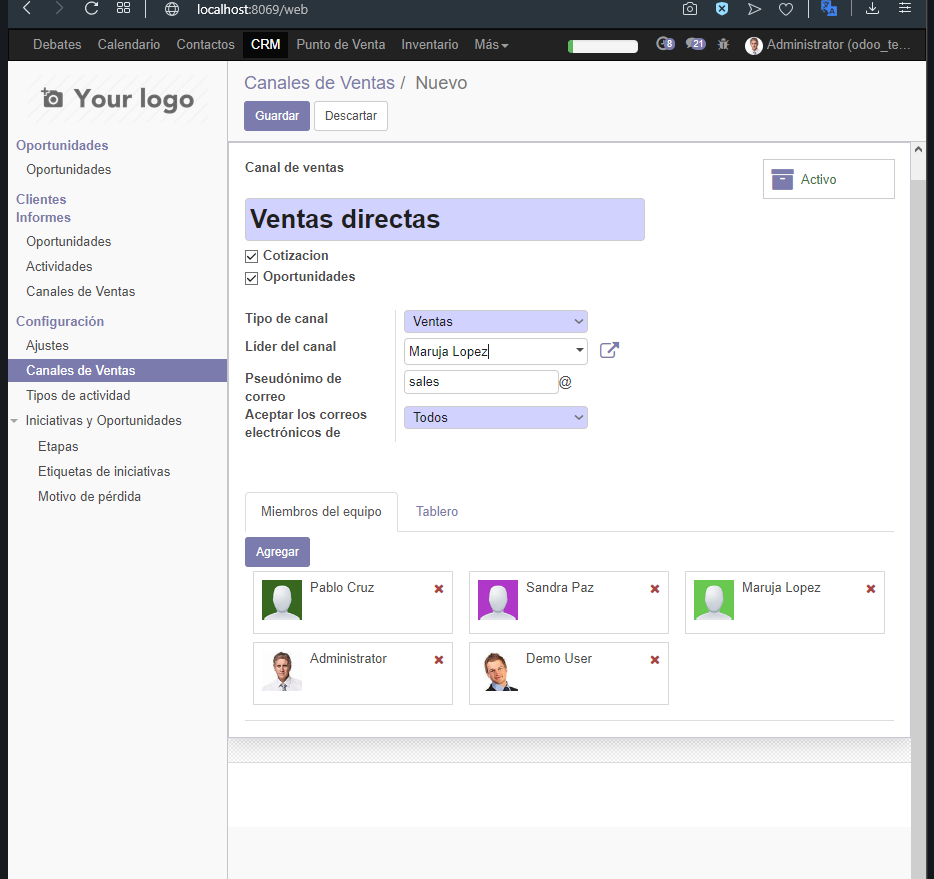
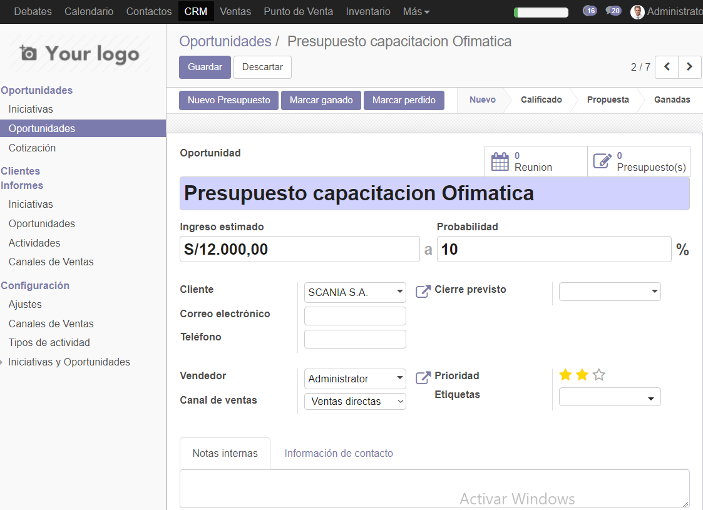

## Laboratorio 03

Primero instalamos CRM.

Entramos e CRM y vizualisamos lo que tiene en donde se ve una barrita y le damos click para luego darle Sgt a todo 

Ponemos nuestras espectativas con objetivos de Venta

Y nuestros KPIS

Las Oportunidades y damos todo siguiente

Creamos un nuevo cliente ACME con sus datos

Vemos que ahora sale en la lista de clientes

Vamos a canales de ventas y creamos uno nuevo con sus mienbros de equipo.

Vemos que ahora sale en la lista.

Vamos a los ajustes de CRM y activamos iniciativas.

Ahora vamos a iniciativas y creamos uno nuevo con su datos.

Luego lo convertimos en oportunidad y asignamos un vendedor que es un cliente.

Vamos a oportunidades y quitamos el filtro y ahi vemos nuestra oportunidad creada hace rato.

Cambiamos la forma de verlo en lista.

Creamos una nueva oportunidad y al crearlo creamos un nuevo cliente

Le creamos un contacto nuevo

Terminamos de crear la oportunidad y le ponemos el ingreso

Vemos la nueva oportnuidad que creamos

Instalamos website Builder y entrando nos dara la opciones de usar bootswatch o pro defecto a lo que le damos bootswatch

Modificamos la personalizacion

Instalamos los contactos y creamos uno lo cual estara en la pagina creada

Selecionamos la iniciativa creada y la convertimos en oportunidad

La calificamos y la movemos a la zona de calificados como se ve

## CONCLUSIONES

- El laboratorio fue largo.
- Hubo muchos inconvenientes ya que no estaba igual que las indicaciones.
- Fue complicado avanzar sin las indicaciones correctas pero se pudo.
- Usamos puro CRM en este laboratorio.
- Modificamos y configuramos el modulo CRM.
- Creamos como una minipagina con un diseño que se hacia rapido.
- Instalamos mas modulos y/o aplicaciones mientras avanzavamos.
- Instale demas aplicaciones para tratar de que sea parecido pero no se veia nd parecido, hubo mucha confusion al hacer.