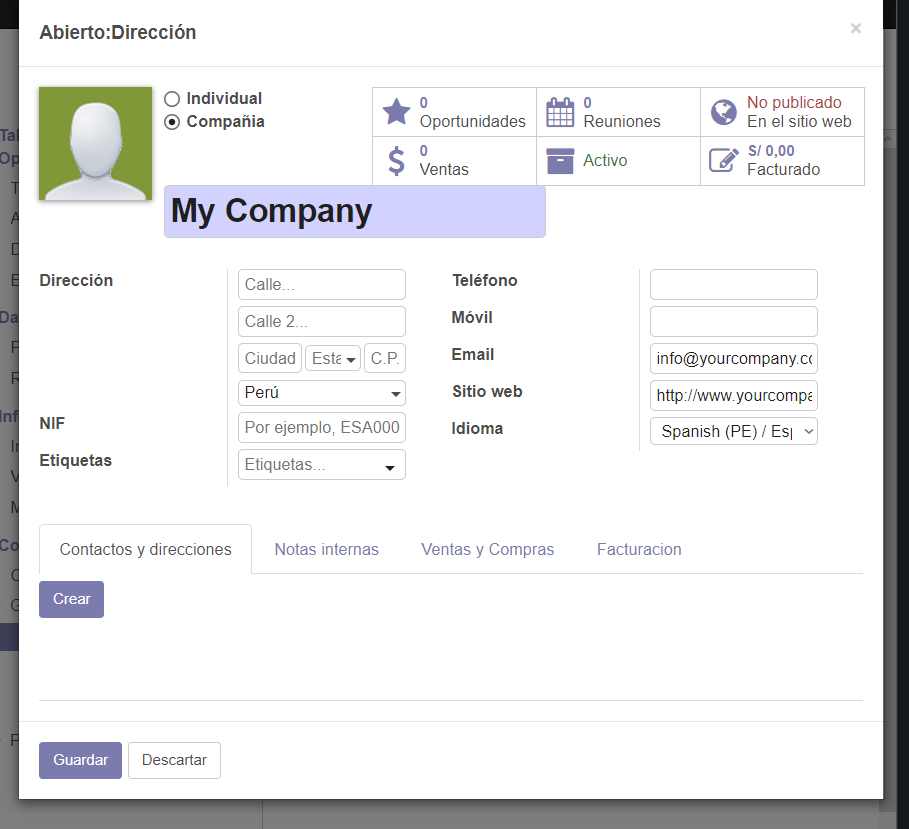
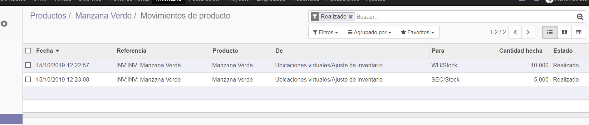

## Laboratorio 04

Primero verificamos que tenemos instalado Inventario si no, lo isntalamos.

Vemos el inventario 

Como tambien podemos ver los Almacenes

Lo configuramos en ajustes y le marcamos el multialmacen

Creamos un nuevo almacen

Con la compañia

Y lo configuramos a lo que nos pide, y creamos un contacto

Luego terminaos de configurar y guardamos

Vemos los tipos de operacioes donde nos enseñan todas las operaciones.

Escojemos lo creado hace un momento y vemos.

Modificamos los ajustes y le activamos Rutas multietapa.

Iremos a productos y miramos los productos que tenemos

Creamos un nuevo producto con los datos que queramos 

Le pondremos la cantidad que tenemos y la guardamos

Ahora exportaremos todos los productos que tenemos en un xls y añadimos mas productos, los que queramos para luego volverlo a importar donde solo se agregaran los datos que no esten

Vamos a ajustes de invetnario y vemos nuestro inventario inicial, como tambien vemos los productos.

Vamos a la transferencia y creamos una operacion de stock donde usaremos catidades altas.

Vemos la cantidad de productos a la mano que tenemos

Podeos ver que ahora tenemos una nueva operacion en el inventario

Vemos la valoracion de nuestro inventario.

Como tambien nuestro inventario

Y los movimientos echos en el invetario.

## CONCLUSIONES

- El laboratorio fue largo.
- Hubo muchos inconvenientes ya que no estaba igual que las indicaciones.
- Fue complicado avanzar sin las indicaciones correctas pero se pudo.
- Usamos la aplicacion de gestion de inventarios.
- Vimos el uso correcto del inventario.
- Creamos productos asi como sus cantidades y sus precios.
- Vimos todo lo que nos permite obesvar el invetario como su valoracion sus movimiento, operaciones actuales y mas
- Modificamos los ajustes de inventario para poder realizar el laboratorio.
- Todo es en tiempo real y cada cambio se puede apreciar bastante rapido.
- Importamos datos en excel asi como aprendimos a exportar grandes cantidades de datos tal como nosotros queramos.