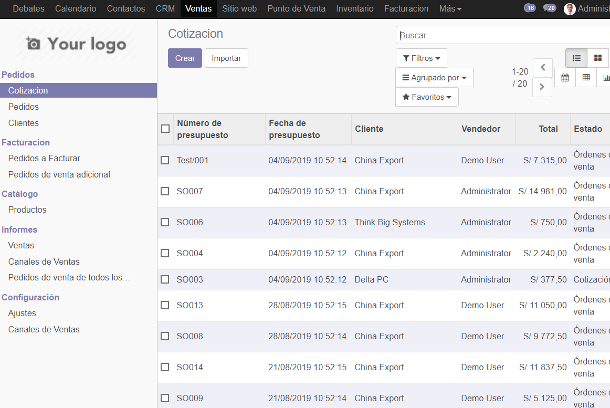

## Laboratorio 05

Primero verificamos que tenemos instalado la gestion de inventario.

Vemos las cotizaciones 

Creamos una nueva cotizacion con mas cantidad de los productos disponibles y nos saldra un anuncion

Guardamos la nueva cotizacion con los datos del cliente la fecha de caducidad y el plazo de pago, con los productos añadidos anteriormente.

Modificamos la cotizacion en ciertos puntos

Y le damos a guardar 

Vemos q podemos mandar un correo a lo cual nos sale lacotizacion echa

Vemos que sale nuestra nueva cotizacion echa en la lista de cotizaciones

Vams a invetario y vemos el tablero

Vemos que esta la cotizacion que hemos echo pero sin stock

Modificamos el producto aumentandole mas cantidad para poder concluir la cotizacion.

Ahora vemos los cambios echos y que ya se puede facturar.

Vamos a facturar y le damos a lineas a facturar.

Vemos nuestra cotizacion

Y mandamos un correo con la factura echa de la compra. 

Tuvimos que modificar la empresa en cierto modo

Vemos que estan los presupuestos de ACME y esta totalmente facturado

Si lo vamos a ver vemos que esta la misma cotizacion que hicimos.

En esta parte modificamos odoo para que pueda enviar correos a partir de uno ya obtenido

Realizamos otra cotizacion con lso mismos datos pero variando el producto

Modificamos ciertos puntos de la cotizacion 

Modificamos las configuraciones de Ventas en ajustes

Y si revisamos nuestro correo vemos que nos llego con un link

Este lik nos lleva a una pagina con nuestra factura echa anteriormente

Cambiamos nuestros datos para q se guarden y finzalizamos el laboratorio

## CONCLUSIONES

- El laboratorio fue largo.
- Hubo muchos inconvenientes ya que no estaba igual que las indicaciones.
- Fue complicado avanzar sin las indicaciones correctas pero se pudo.
- Usamos la aplicacion de gestion de inventarios.
- Continuamos usando la aplicacion de gestions de inventarios.
- Usamos la Gestion de ventas que a la par nos instalaba las facturaciones.
- Hicimos que nos mande correos al hacer una cotizacion o factura.
- Modificamos las configuraciones de Odoo.
- Configuramos el Gmail para poder recibir correos desconocidos.
- Se vio las alertas cuando intentabamos dar mas productos de los que teniamos.