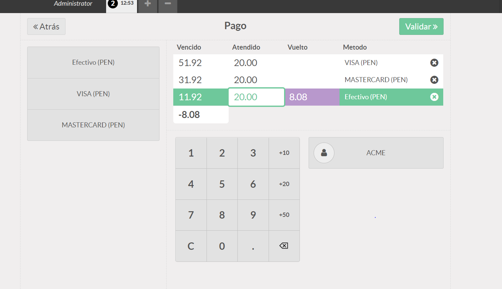
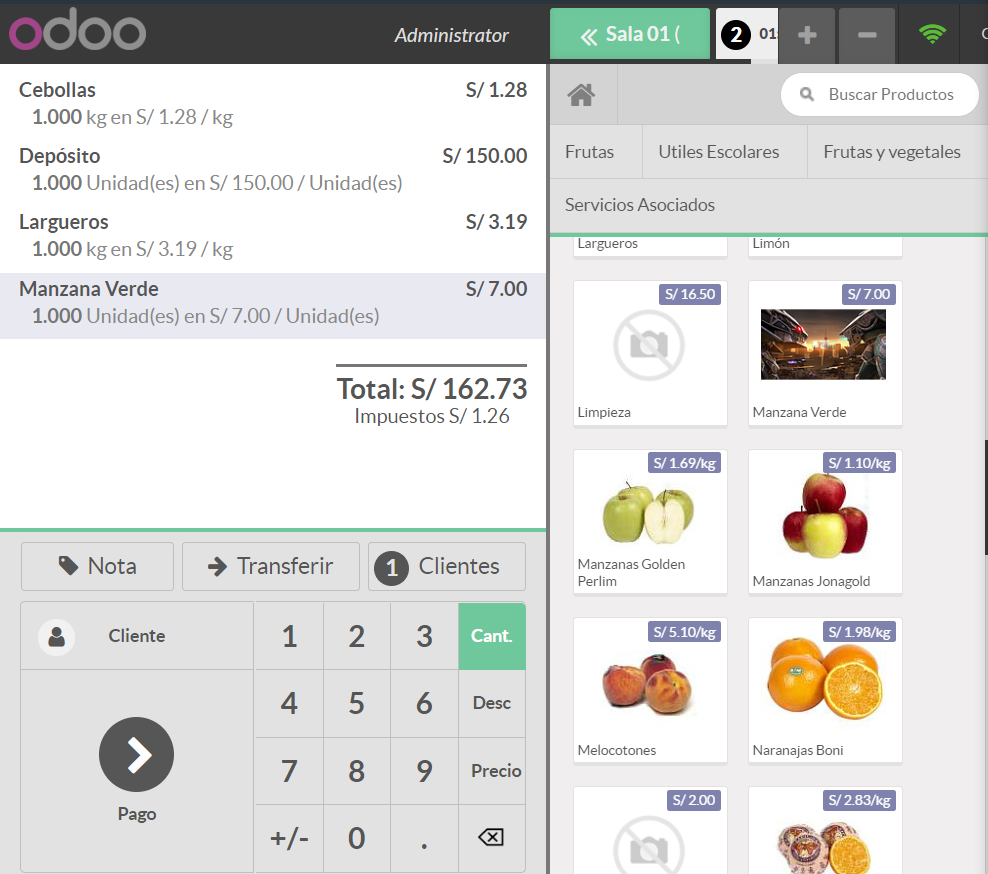

## Laboratorio 07

Primero verificamos que tenemos instalado punto de venta.

Vamos a ver la primera pantalla y que nos permititra crear una sesion 

Vamos a una interfaz donde podemos escoger productos que llevara y se iran sumando las cantidades.

Podemos escoger al cliente que le venderemos

y si le damos a pagar nos manda a una pagina donde pondremos con cuanto estan pagando

Nos pide una cantidad para pdoer proseguir lo modificamos y seguimos y vemos cuanto de vuelto tenemos que dar y en que pagaremos que seria efectivo.

Si continuamos vemos una boleta con todos los detalles.

Ahora vamos a las sesiones y vemos que esta la sesion que hicimos

Si entramos a una sesion vemos lo que esta sucediendo hasta ese momento

Vamos a la configuracion de punto de venta y activamos las configuraciones dadas asi como las moficiamos

Agregamos los medios de pago que nso pide como visa y mastercard

Seguimos modificando los ajustes.

Vemos que ahora al crear la sesion nos manda a una pantalla donde estableceremos el balance de apertura

Una vez continuemos veremos mas detalles de esta y continuando nos llevara a la calculadora vista anteriromente

Le pondremos productos para hacer una simulacion.

Ahora vemos los modos de pago y podmeos intercalarlos donde veremos que nos daran vuelto igualmente porque nos pasamos.

Regresamos y abriendo otra pantalla creamos un nuevo usuario que sea cajero con permisos especificos el cual no puede modificar el precio como un administrador.

Lo dejamos en administrador y continuamos.

Creamos nuevas categorioas en la zona de producto configuracion y categorias de PdV.

Les agregamos contenido a cada categoria.

Vamos a crearuna nueva sesion que se llamara cafeteria la cual al momento de intentar crear con esta nos dara un error para esto debemos cerrar la anterior sesion.

Vemos que nos sale de una forma distribuida como si fuera un restaurante que es lo configurado. y al crearlas y seleccionarlas nos mandara como si fuera una orden de tal mesa en donde le podmeos añadir productos pedidos por esa mesa.

Probamos su funcionamiento veremos el pago con lo mismo de siempre con la boleta y todo normal

Vemos que se pueden agregar notas para tal mesa o hacer una transferencia de pedido a otra mesa

Vemos que podemos hacer el mismo proceso que cualquier otro.

Modificaremos el putno de venta cafeteria activando ciertas opciones.

Vemos que hay nuevas opciones recibo y dividir las cuales hacen que vizualisas un recibo previamente o puede dividir la cuenta en 2 o 3 o mas partes.

## CONCLUSIONES

- El laboratorio fue largo.
- Hubo muchos inconvenientes ya que no estaba igual que las indicaciones.
- Fue complicado avanzar sin las indicaciones correctas pero se pudo.
- Usamos punto de venta para esta ocacion.
- Vemos que esto se puede usar para un restaurante ya que controla todo las ventas en ubicaciones ver si estan llenas o no.
- Configuramos cada parte echa para logar un resultado concreto.
- Se puede usar tambien para una tienda controlando cuanto esta llevando cada cliente.
- Vimos que podemos dar permisos a usuario los cuales no pueden modificar los precios a comparacion de un administrador.
