## Laboratorio 09

Creamos todo nuestro modulo de facturacion llamado Peru con el icono descargado
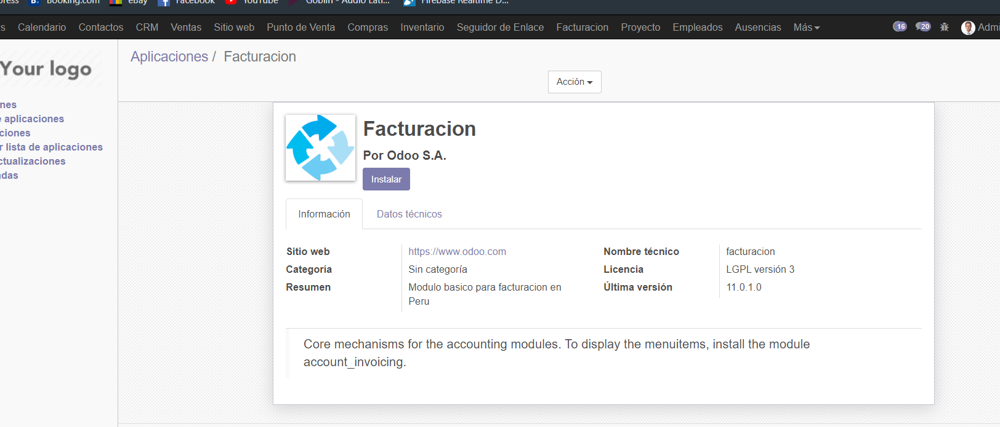

Le damos un vistaso a todo lo que tiene
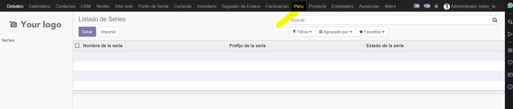

Vemos que podemos crear un listado de series de una forma un tanto normal
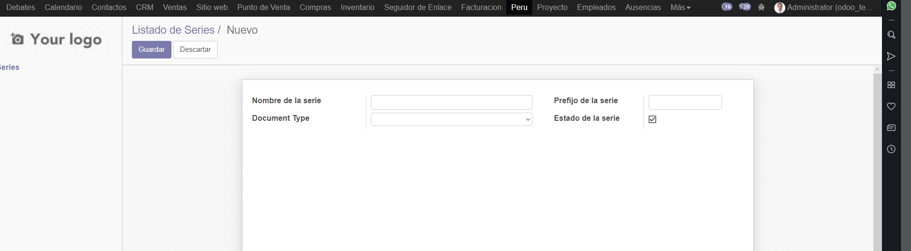

La mis aforma de crear pero con diferente diseño despues de modificar el codigo y creamos uno para probar
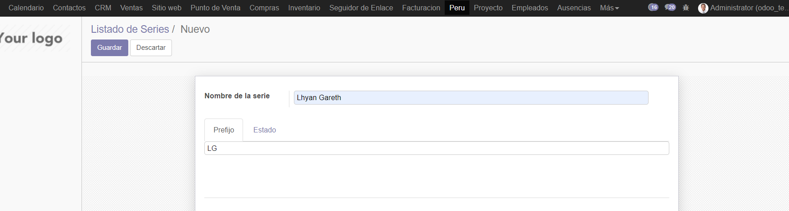
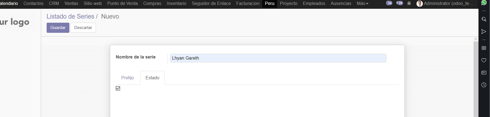

Vemos que sale en la lista echa.
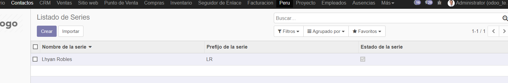

Creamos mas series

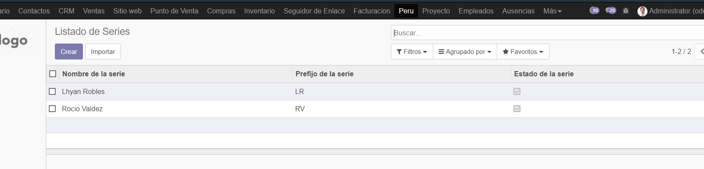

Despues de modificar codigo vemos que ya se puede buscar por prefijo y por nombre a lo que antes solo se buscaba por nombre

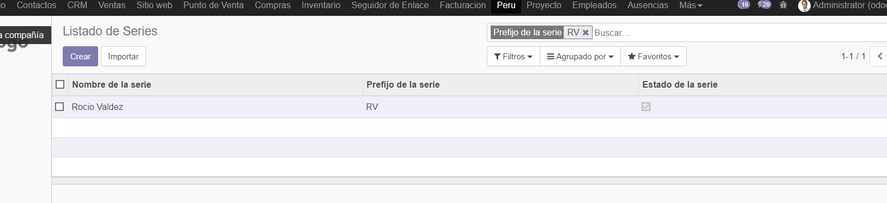

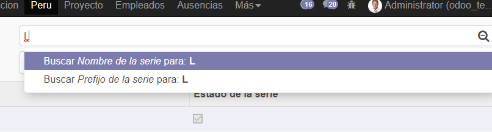

Agregamos mas series por codigo ya escrito

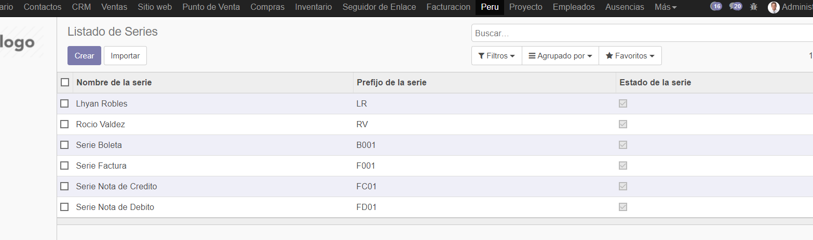

Creamos un archivo y le ejecutamos con node para instalar los paquetes.

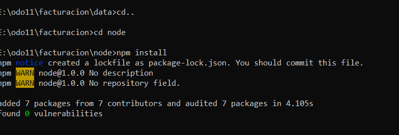

Vemos que tenemos toda una api con los datos que teniamos en la interfaz de series

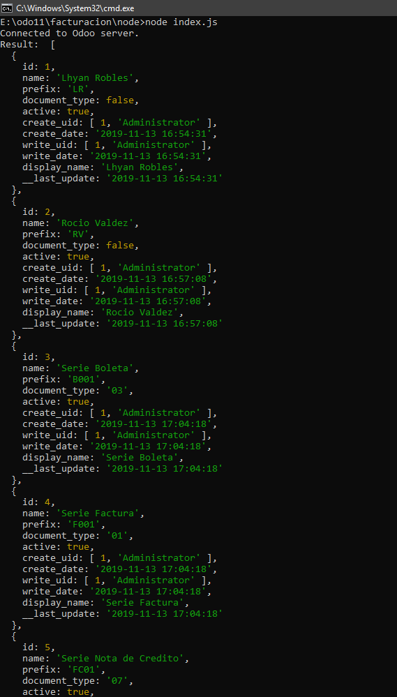

Vemos en el bichito una ventana para editar la vista del formulario

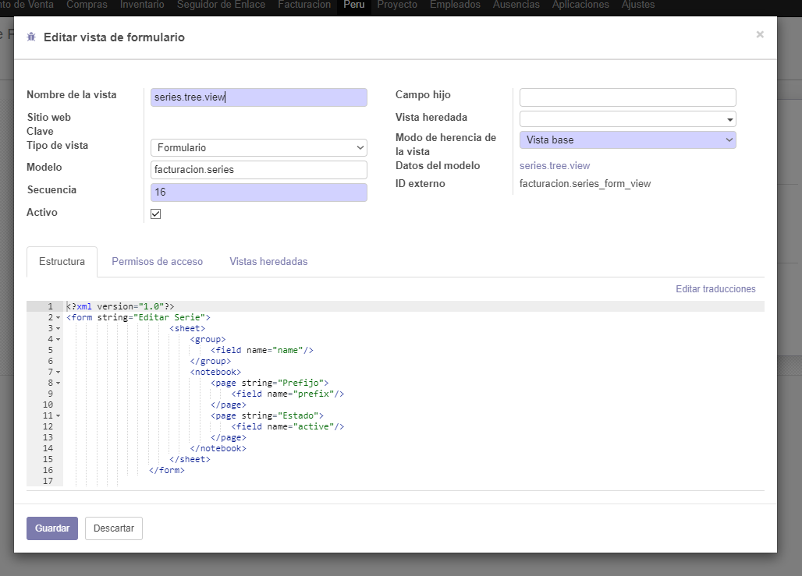

Finalmente vemos como lo creado ahora va a una serie electronica en lo que es facturacion

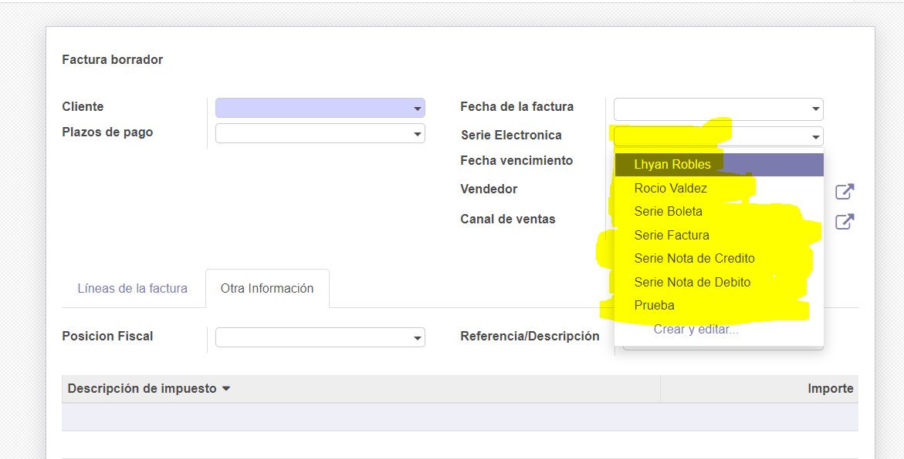

## CONCLUSIONES

- Creamos nuestro propio modulo con python
- Modificamos la interfaz que nos daba la instalacion del modulo a nuestra manera
- Configuramos el metodo de busqueda.
- Usamos node js para controlar la api de odoo creada por nosotros
- Empezamos el modulo desde cero con la creacion de todo
- Vemos que lo echo se conectaba con la facturacion y salia series electronica con lo creado por nosotros.
- Usamos todo en modo desarrollador para poder modificar.
- Estuvimos actualizando constantemente el modulo.
